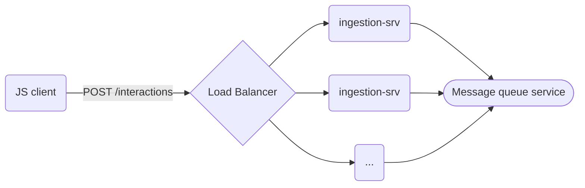
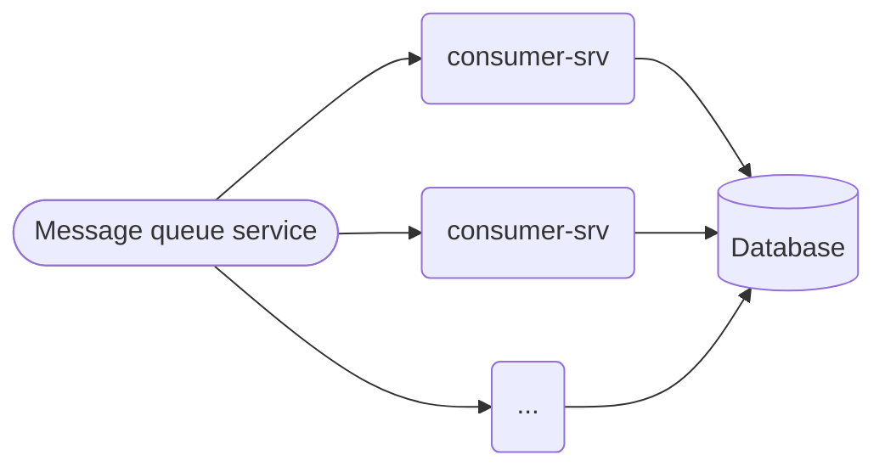
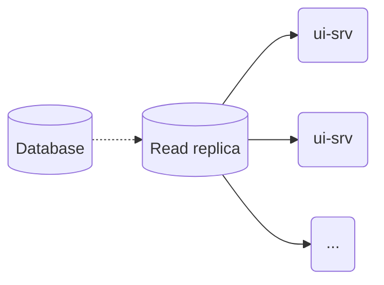

# Interviewing as a Software Engineer
*20 minute read*

Interviewing is hard. In different ways for both parties. On the hiring side,
you need to have a good framework for evaluation in place, and make sure that
your engineers understand and apply that effectively. Failure to do so leads to
bias, indecision and ambiguity in decisions. Which isn't great for either
party.

If you're on the hiring side, your interview process is not just a means for
you to hire -- it's also an effective way to advertise for your company's
brand. No matter the outcome of the process, the candidate should be walking
away with a great impression of your engineers, your hiring process, and your
company.

## Intended audience and scope
I'm mostly writing this post for my brother who's graduating soon. It should
be useful for anyone looking to land a job at FAANG or other top-tier tech
companies.

## The interview process at top tier companies
Among the companies I've interviewed and landed offers from, their interview
processes look roughly the same. The process is split between a qualifying and
an on-site portion.[^covid]

#### Qualifying interviews
1. Chat with a recruiter
1. Programming
1. Chat with manager

#### On-site interviews
- Programming
- Debugging
- Systems architecture
* Career

These do differ slightly between companies. E.g. some companies don't have the
manager chat in the qualifying round of interviews, and some have several
programming challenges during the on-site.

The qualifying interviews are intended to assess the candidate's probability of
success for the on-site interviews. In my experience, they're more brief but
roughly equal in difficulty to the on-site interviews.

## Interviews
Some of the interviews overlap in their rubric, for instance the programming
interviews are most often judged in similar fashions. I'll try to not repeat
myself too much below.

### Chat with a recruiter
The initial step of the process is a chat with a recruiter. Most times they'll
ask you about your past experiences, and why you're looking for a new
opportunity. They're also looking to see that you would fit into the culture at
the company you're applying to.

This interview is all about making a good impression as a person. Even though you
might not be applying to a new job for a positive reason, you have to play the
game and turn that into a positive, or leave it out:

- 👎 My current role isn't fun

  👍 The challenges your company is facing are exciting
- 👎 I don't like my current boss / company

  👍 I think that your company has great engineering culture
- 👎 I'm not getting that promotion

  👍 I think I can grow well in your organization

Make sure you let them know you'd be excited to work for them! Barring anything
strange popping up, the recruiter screen mostly feels like a sanity check before
kicking off the real process.

### Communication
This is not an interview itself, but it's a common to all interviews and by far
one of the most important skills you will be judged on as an engineer.

Whether the interview has you programming, sketching a system, or talking to
someone -- you will be judged on how you communicate. This is true both when
the interview is going well and when it is going poorly.

During the practical interviews, you're being judged on how you're approaching
the problem. Make sure you communicate, not just what you're doing, but what
you're thinking about doing next.

If you're stuck when debugging something, say that out loud: "I'm now stuck,
because I don't know X". Then proceed to let the interviewer know how you'll
try to forge ahead.

In all the places I've worked, candidates can receive a hire recommendation
despite bombing an interview, but that's prefaced on knowing why the candidate
did poorly during that phase of the process.

A good candidate doesn't just give great answers when prompted, but also asks
great questions of the interviewers. Some of the greatest interviews I've had,
the candidate has been in the driver's seat from getting their prompt - they're
asking all the questions and driving the problem forward.

Lastly, make sure that you're receptive to feedback and questions. If the
interviewer is hinting about something, hear them out. There's nothing worse
than an interview where the candidate is adamant about their solution. Most
interviews can be at least somewhat collaborative.

### Programming
This section covers both programming in the qualifying and during the on-site.

The programming challenge is different depending on organization. Apart from
Google and Facebook, most companies I've interviewed for have a simple
programming challenge[^cracking-the-coding-interview].

At a former employer, this was a take-home challenge that you solved in an
online editor where you write and run tests. If you passed the take-home
challenge, you'd discuss the solution with an engineer, possibly make some
minor improvements, and then solve an extension to the exercise.

At other places, the coding challenges have all been done in
[CoderPad](https://coderpad.io/). It'll be very much worth your time to try out
the platform. Make sure you're familiar with how to both write code _and tests_
using their editor.

Some places allow you to use your own setup. If you plan on using your own
setup, make sure you're able to both run code, tests, and use a debugger.

When it comes to the type of challenges, I'll give a couple of examples of
things that could pop up[^none]:

- Write a function to get the two largest elements of a list
- Write a caching layer to amortize an expensive operation
- Parsing strings and returning structured data

From the hiring side, when giving problems like these, what do you look for?

#### Structure both in terms of code and approach
Most of these interviews contain some form of problem statement for the
challenge, usually as a short text snippet. These problem statements are
rarely complete **don't jump in straight away**. Just like in real life, you'll
need to **ask questions** in order to figure out the invariants. Maybe you can
even skip some portions that you originally envisioned you had to provide. Note
and ask about edge cases.

When you start implementing the code, think about the function, its arguments and
return value before writing any implementation. E.g. in Java

```java
public static List<Color> parseColors(String input) {
  // TODO - implement
  return List.of();
}
```

or Python:

```python
def parse_colors(input: str) -> list[Color]:
  # TODO - implement
  return []
```

that way you can already now scaffold a simple hello-world test. Does the given
prompt contain any examples for expected output? Encode those as tests too!

It's not important that you know the stdlib APIs of your language, but make
sure that you're familiar with common operations. Most importantly you should
be able to write idiomatic and well-structured code.

Once you're done with your initial take, go over it. Did you miss anything?
Should you improve the phrasing anywhere? Are there more edge-cases? Have you
tested all examples?

Don't be afraid to run your code often, this exercise is supposed to show the
interviewer how you work in your day to day. Would you write all the code
before hitting run or compile? Or would you do it piecemeal? Probably the
latter unless you use a very sophisticated editor.

In none of the places where I've interviewed candidates have we "deducted
points" for when the program doesn't compile or give the expected output on the
first try. It _is_, however, quite common that I see folks writing _a lot of code_
without knowing if it'll compile. It puts these candidates at a disadvantage.
They'll have to spend a bunch of time fixing their mistakes before seeing if
the code actually does what it is supposed to.

Another consideration is just how testable your code is. Sometimes you'll be
asked to write a function that is side-effectful in nature. It requires access
to a randomness or perhaps reading something from the environment. This makes
testing your solution effectively, a lot harder. Consider creating an internal
function that you can delegate to:

```java
public static User createUser() {
  var uuid = UUID.randomUUID();
  return createuser(uuid);
}

static createUser(UUID uuid) { ... }
```

now you can test the package private one deterministically.

#### Language proficiency
Make sure you're able to fluidly write code in your chosen language. Most
companies would be happy for you to search the web for how to do things, that
is an important part of your real job.

That being said, you should probably not be searching for how to do basic things
in your language. You should know how to iterate through collections, how to use
common data structures like sets, maps, and lists.

Be up-to-date on the language of choice, but don't unnecessarily lean into
advanced features. If you choose Java, do you know about modern additions like
`var`? If you choose JavaScript, do you know how to destructure maps and lists?

You should also know how to test given your language of choice. That means
familiarizing yourself with unit testing frameworks.

### Chat with a manager
This is usually scheduled with the hiring manager, the person who'll likely be
your direct superior. During this interview you'll likely discuss your
experience at previous employers, your greatest accomplishments, biggest
regrets, as well as your future goals. Be ready to answer why you're looking
for a new opportunity.

Your answers don't have to be clever, especially when asked about regrets and
weaknesses. Be genuine. If you made a mistake, show that your learned something
from it. When describing your weaknesses, don't turn them into strengths. Show
that you're aware of them and let the interviewer know how you handle them.[^best-advice]

When discussing your past contributions, be concrete. Sometimes engineers who
do a lot of cross team collaboration and glue work, feel like their work wasn't
as important as the ones who wrote the code and will hand-wave. I say, it is as
important, own it!

This brings us to goals. For junior engineers, I know it's hard to be concrete
here. Here you've got to play the game, the interviewer has probably let you in
on what the team is about, be cognizant of that in your goals. Does the org or
team align with those?

I've sometimes seen people ask about mobility within the company. Sometimes
that's a great selling point, but bear in mind that the hiring manager is most
likely trying to fill a slot on _their_ team and would probably not want to see
you move teams in the near future.

As an individual contributor, the manager is also looking to see that you're
easy to collaborate with. No matter how senior you are, show that you're
coach-able.

### Debugging
I've seen a few versions of this. Spotify had an interesting one, where we
role-played that a service was misbehaving and it was up to me to diagnose it.

Others present you with some code where you attempt to diagnose, fix and verify
the issue.

The [Systems architecture](#systems-architecture) section has some overlap with
debugging a service, so I'll focus on debugging code in this section.

#### Approach
Fixing bugs is something every engineer does, even if it wasn't they who
introduced the error. The point of these types of exercises is to see how you
diagnose and fix issues. Sometimes you'll be given a failing test-case which
you can use as an entry point. Sometimes, you'll need to recreate the error
yourself. If you can, capture the issue in a unit test.

How you navigate the codebase is important here. Do you wildly grep and pray?
Or do you have a methodical approach to finding the root cause?

When you've an IDE where you can jump to definition, that's most commonly enough
to navigate the code. If you're using a dynamic language without such support,
grep might be justified.

Try to build an intuition for how the code is structured, and then build a
hypothesis. Once you have an idea, try to confirm it somehow. If it proves
false, abandon it and backtrack to the last place where you had a firm footing.

Don't try to read all of the code. Most likely if you're given a repo, it'll
be too large for you to be able to digest and fix the error within the allotted
time.

Making progress is key, most likely you won't have to solve the bug in order
to pass the interview. Build an intuition for the structure of the code come up
with a hypothesis, confirm or reject, iterate.

#### Proficiency with language and tools
I cannot recommend enough that you're strategic in your choice of language and
setup. I've seen candidates choose a language that they'd like to work in
(Haskell), and failed miserably because they're either not proficient enough in
it - or they're not able to get their setup to work for the interview. Most
commonly, people can't get the debugger to work properly, or the language server
doesn't work for one of the common tool chains (Stack vs Cabal, Maven vs Gradle).

Also, make sure you're able to build and modify sample projects. Clone something
from GitHub and try to build it, change some tests, run them, use the debugger.
These are basic things you should know how to do.

Learn how to set breakpoints, what stepping in, out and over mean, and how to
evaluate expressions.

If your language of choice has several package or build managers (yarn vs npm,
maven vs gradle, stack vs cabal), it's a good idea to be able to do the above
for all of them!

What about debug by print statements? That can be fine, make sure you're
methodical thee as well. Try to print relevant things, not just `"HERE"`!

### Systems architecture
I really love giving systems architecture interviews. They're a lot more open
than some of the other interviews. As such, there is _so much_ to write on
the subject of this interview type.

Some of the design interviews talk about API design, and some of them focus
solely on building a system with different standard components.

When it comes to designing a good HTTP API, I recommend reading up on how
to create a REST API. It's not a panacea and there are times when diverging
from RESTful APIs leads to better design, but as a starting point it's a good
tool to have in your toolbox.

Let's focus on the interview type where you're asked to design a system. In
this type of interview, assume general components. RDBMS over Postgres, NoSQL
over MongoDB or DynamoDB, pub-sub over Kafka, message queue over SQS. Specific
knowledge of how these types of components work and scale is a must to succeed
in this interview.

#### A case study
Here's an example prompt for a design interview:

> Our company Weta, wants to track how often a certain component is interacted
> with on our website. Your task is to design the system that records
> the users' interactions like "hover-in", "hover-out", "click" on uniquely
> identifiable components.
>
> The data should be available to our teams via a web UI.


##### Gathering requirements
This should be enough for you to start gathering requirements. Divide these
into "Functional" and "Non-functional" requirements.

**Functional requirements**
: Describes what the system does and how it should do them

**Non-functional requirements**
: Describe what the performance characteristics of the system should be

In our case study, we need to ask clarifying questions to determine what goes
into each category. These interviews tend to run around 45 minutes to an hour.
As such, it's important to make sure what is actually in scope. The interviewer
is probably happy to answer any such question.

Another consideration is whether to go for a completely scalable solution, or
an MVP at first, ask your interviewer. For our case, let's go for the scalable
solution.

Here are some questions I'd ask to determine requirements:

* What data should we track for the events? Timestamps? Duration? Users and how
  we identify a user in our system?
* Are we only concerned about the listed events? Should the API be extensible?
* Can we combine `hover-in` an `hover-out` to a single `hover` metric?
* What does traffic look like to our website? I.e. what type of scale do we
  want? How many actions per user per minute do we expect?
* How fast should the data appear in our operator UI? Can the system be
* eventually consistent?
* What are the availability requirements for our operator UI?
* What should be visible via the UI? Does it affect our events? Do we need to
  fetch data from other systems?
* Is some data loss acceptable?
* What regions of the world do we operate in?

> #### Functional requirements
> * Ability to specify event types with different payloads
> * For now, only work with the "click" event which should have a timestamp
>   along with the ID of the component (string)
> * The operator UI should be able to query the data by hour of day
>
> #### Non-functional requirements
> * The data does not have to appear immediately in the operator UI
> * The system can be eventually consistent
> * Our startup has around 200k active users with peak traffic of about peak
>   traffic of 4 million interactions per minute (~67k interactions per
>   second, at 20 interactions per user)
> * We can endure some data loss, but we should be able to gauge usage reliably
> * The operator UI should have an up-time of three nines (99.9%)
> * Our users are primarily in Europe, but we've plans to expand to North America

Depending on the interviewer they could elect to simplify the situation. For
instance, by limiting scale or responsiveness. Or by restricting the input and
output of the system. In the requirements above, we have a simple query pattern,
a single event to deal with, and some acceptable data loss!

##### Proposing an initial solution
Given that we can allow some data loss, we'd be best of batching interactions
on the client side. Instead of 20 interactions being sent per minute and user
we can reduce that to one request per minute and user.

$$\frac{200'000 \text{ users}}{60 \text{ seconds}} \approx 3300 \text{ requests / second}$$

A sample of such a request might be:

```js
// A POST request to `/interactions`
[
  {
    "event_type": "click",
    "occurred_at": <epoch ms>,
    "component_id": <string>
  },
  ...
]
```

It's good to mention here that there would need to be some authentication
mechanism, but we'll scope that out.

The recipient service has one job, to put these requests on a message queue.



The JS client posts to a known gateway that distributes the traffic to our
service, `ingestion-srv`. We're batching the requests on the client, but can
scale the amount of services here to accommodate an increase in traffic.

After putting the message on a queue, we'll consume that message on the other
side:



At our current peak traffic, a single consumer is likely to suffice. At this
point we have another opportunity to batch. This time, we would like to batch
increments to the counter for each component ID and hour. We can enable this
by partitioning the messages by component ID when we enqueue them - note that
this means we can batch on both `ingestion-srv` and `consumer-srv`.

Given our current batching strategy, it's somewhat feasible that we'll be able
to amortize the writes to be linear to the amount of components on the page. Even
with hundreds of components, any RDBMS should be able to handle so many updates.

We've yet to add the UI component. Since this system is write heavy, it's worth
adding read replicas to the database. Our UI service will then read from that
replica:



At this point we have a complete system that satisfies the requirements. Now
is a good time to go through the design and note weaknesses. What does cost
efficiency look like for this solution? Where are the bottlenecks? How does
this scale if we increase the traffic? Does it require operator intervention?
Can we seamlessly scale this to multiple regions? Can we distribute the
database? Do we need caching? How do we monitor this system?

Show the interviewer that you're thinking about these things, in most cases
these interviews contain a decent amount of back and forth.

#### Standard blocks to know about
This is a non-exhaustive list of standard components that you'd do well to
know about. Just like with programming languages, learning one type is a
transferable skill. Learn the invariants of each ones! How they scale, what
their strengths and weaknesses are.

##### Scaling
We usually talk about scaling in two terms, _horizontal_ and _vertical_. If we
want to scale our application, we can either run it on a more powerful machine,
this is vertical scaling. Or we can distribute it on many machines, this is
horizontal scaling.

##### Load balancers
A load balancer works as a proxy and distributes traffic across multiple
machines. Their main purpose is to be able to increase the amount of concurrent
requests to a service. Load balancers work at different levels of the OSI
stack -- think application level vs network level.

There are different strategies for distributing the load, most notably:

Round robin
: Distributing traffic evenly across machines

Sticky sessions
: Directing a user's traffic to the same machine for the duration of a session

##### Databases
There's a lot to say about databases. So let's simplify things. There are two
categories of databases you should be concerned with - relational and NoSQL.
They're uniquely good at different things.

Relational databases store data in tables with pre-defined formats and rules.
They are flexible in that they allow you to join data in arbitrary ways. They're
great for structured data - to simplify, if you would store the data in a
spreadsheet, a SQL database is probably a fine choice.

With the right schema, a relational database can easily handle tens of
thousands of inserts per second.

In terms of scalability, there the responsibility lands on the developer to define
the schema in such a way that the tables can be distributed on many machines --
as well as adding the logic to the application. There are systems like
[Vitess](https://vitess.io/) for MySQL that allow you to distribute your
database without manual sharding at the application level.

When it comes to NoSQL databases, there are quite a few different concepts to
be aware of:

- Key-value
- Graph
- Document
- Column oriented

NoSQL databases attempt to offer scale and flexibility that traditional
relational databases don't.

Familiarizing yourself with
[MongoDB](https://docs.mongodb.com/manual/tutorial/getting-started/) is a good
idea, it has an online playground and several easy to follow tutorials.

If your access pattern is key-value based, NoSQL databases are a near perfect
fit.

##### Message queues and topics
There are different types of messaging systems you should be aware of. In
general, you can split them into queues and topics. A queue works like you'd
expect, you push a message onto the queue and then you dequeue it at the other
end, FIFO.

Queues operating in FIFO mode have limitations on their throughput, AWS SQS in
FIFO allows at most 300 enqueues per second - or at most 3000 messages when
batching.

An invariant of using a queue is that your consumer(s) only receive each
message once. The drawback, being that scaling can be harder to achieve.

A topic is similar on the producer side. On the consumer side, each consumer
receives all the messages from the topic. This is great if you need to do
a number of different things per message that are orthogonal to each other.

Topics scale by partition. Typically you either decide statically how many
partitions you will have, or the system scales the number of partitions
based on e.g. consumer lag. A partition key can usually be manually determined,
in our case study, we chose the component ID as the partition key. Each partition
can have one consumer per consumer group and thus your consumers can scale with
the number of partitions.

A system like Kafka can typically process ~900k transactions per second on a
single partition, depending of course on message size.

##### Monitoring

##### Cloud storage

[^covid]: Naturally, during COVID-19 both parts of the interview process would
  be remote.

[^cracking-the-coding-interview]: As opposed to Google and Facebook where the
  challenge was indeed a [Cracking the Coding
  Interview](https://www.crackingthecodinginterview.com/) type challenge.

[^none]: None of these are the actual questions I've been asked, or I've given.
  However, the themes of them should be enough for you to gauge the sort of
  challenges.

[^best-advice]: One of the best pieces of advice I ever received was not to
  focus on eliminating my weaknesses, but to lean into my strengths.


