# Monorepos done right
*8 minute read*

There's a lot of arguments for and against monorepos. Done right, I believe
monorepos will help you move with urgency and focus as your engineering
organization grows. That doesn't mean it's easy! I've also seen monorepos turn
into monoliths that block teams from getting anything out in a timely manner.

## The basics
If your organization puts all its code, and all assets that go along with
that code into a single repository; you've got yourself a monorepo.

The opposite of this is a multirepo setup where projects are split into several
different repositories.

There are a number of things I really like about monorepos:

- **Single source of truth**

  Code changes are atomic, no need to sync schemas over several repos.

- **Visible cost of change**

  Altering code now requires you to make sure that all existing code usage
  is updated or compatible with the change.

- **Sharing and reusing code**

  Discoverability for existing functionality and reusing existing components
  is greatly simplified. This also includes versioning and aligning
  dependencies across the org.

- **Improved collaboration**

  Having to wrangle permissions and aligning several repos is not an issue.
  Just change the code and get the proper reviews!

There are real downsides to putting everything into a single repo.

- **Unrelated breakages**

  Someone else's code or tests are broken to no fault of yours

- **Pipelines taking way too long**

  Build, test, and deploy cycles growing linearly with the size of the
  codebase.

- **VCS not scaling to meet your needs**

  Your version control system not being able to handle the sheer number of
  references and operations done to the repo.

- **Access and code ownership**

  Your organization might not want you to have access to the entirety of the
  codebase, and conversely, you might not want everyone to be able to approve
  code changes to code owned by your team.

- **Shared pain**

  The health of the repo is now the health of developer productivity at your
  org.

## Getting things wrong from the start
It's incredibly tempting to take your usual set of tools and apply them to a
single repo and call it a monorepo.

You set up up pipelines to run your tests, on merge you deploy your services.

```mermaid
graph LR
 A(Merge PR) --> B("Build 🏗")
 A --> C("Test 🧪")
 B --> D("✅ ?")
 C --> D
 D --> E(Deploy services)
```



This works really well for multirepo setups! It works rather well for a nascent
monorepo as well.

This, however, gives you not a monorepo, but a monolith.

##### Testing is per target
Testing and building is not the same thing! A hermetic build system will allow
you to rebuild the minimum set of changes.

With monorepos, however, you need to also think about testing and deployment as
a per-target concern. When changing the code for a service, what should be
tested in order for you to confidently be able to deploy the service?

##### Flaky tests
You also need to decide what to do about flaky tests. In a very small team, it's
quite possible to eliminate flakiness. For a whole org, it isn't. It's going to
happen, so you have to figure out a way to deal with it.

##### Merge races
A merge race occurs as a conflict due to a merge, on the semantic level as
opposed to a conflict on the VCS level.

Consider two pull requests changing the same file. They both pass CI on their
individual branches, but when merged even though they don't conflict on the VCS
level -- they introduce an error. It could be, for instance, that the first PR
changes the signature of a method, and the second one introduces a new usage of
the old version of said method.

This is not such a problem with multirepos, as the occurrence of merge races is
(among other things) proportional to the amount of changes per time unit.

The easiest mitigation is to serialize merges to the main branch. However,
naively serializing merges does not scale. At Stripe, my current project is to
implement a speculative approach to testing and merging changes, this will
allow us to scale merges to hundreds of commits per hour while keeping the main
branch green.

## Trying to get things right from the start
This is why I'm writing this post. Most monorepos I've been exposed to have a lot
of history and it's an interesting thought experiment how to do this if starting
from scratch.

I want to be able to run a monorepo with a small team of engineers dedicated to
the infrastructure, it should be obvious to other contributors how the repo works.

### CI
As a contributor, when I push a branch, I want CI to pick up my changes and run the
associated tests. If the tests pass, I'll ask for the appropriate reviews and
once approved merge a PR with my changes. Once the PR is merged, I want to be
able to deploy my code changes.

A first stab at this is to use a hermetic build system that offers caching of
unaffected build artifacts. That way, we'll only rebuild the minimum set of
changes.

In real life, using a hermetic build system _for tests_ does not actually
scale for pre-merge checks. The dependency graph of your repo becomes entwined
with how much of your repo gets tested. Change a deeply nested component often?
Even though you only want to deploy one out of all your services, you'll get
full rebuilds of your repo.

I still think a hermetic build system is the way to go; but I wouldn't gate
_merges_ on testing the full repo. Instead, let's give some flexibility to our
engineers.[^post-merge]

If we have the service `toy-srv`, the developers of that service should be
comfortable in declaring what needs to pass in order for the service to be
deployed.

Let's say each service directory contains some `src` files and some `test`
files. A `BUILD.bazel` file that specifies build targets, and a `metadata.yaml`
file that we can populate with repo specific infra:

```txt
.
├── toy
│   ├── src
│   ├── test
│   ├── BUILD.bazel
│   └── metadata.yaml
├── shop
│   ├── src
│   ├── test
│   ├── BUILD.bazel
│   └── metadata.yaml
└── metadata.yaml
```

The `BUILD.bazel` file might contain the instructions for creating runnables
for the two services. You can imagine that `shop-srv` depends on `toy-srv`.

In a monolithic world, all code would need to pass in order to deploy either
service. Instead let's imagine that the teams responsible for these services
have defined the constraints in their respective YAML files:

```yaml
# ./toy/metadata.yaml
ownership:
  - toy-team

merge_requirements:
  - test: //toy/test/...

services:
 - name: toy-srv
   target: //toy:ToyService
```

This file states that the current directory is owned by the `toy-team`, for
now, we can assume that at least one member of the `toy-team` must review PRs
to this directory.

When a branch is pushed with changes to this directory, CI will look at the
diff to determine which `metadata.yaml` files are affected. It will then
proceed to build all changes and test the required targets listed under
`merge_requirements`. This file says to run all the tests for the `toy`
directory, the syntax `//toy/test/...` is Bazel for, all the targets under
`./toy/test`.

Given that we have an approval from the `toy-team` and the tests specified have
succeeded, we may merge the change. However, we may not deploy `toy-srv` until
the required build has completed.

Let's take an example with a different service `shop-srv` that depends on
`toy-srv`:

```yaml
# ./shop/metadata.yaml
ownership:
  - shop-team

merge_requirements:
  - test: //shop/test/...

services:
  - name: shop-srv
    target: //shop:ShopService
    deploy_requirements:
      - service: //toy:ToyService
```

This team has been a bit stricter in what they require in order to merge
changes to this directory. Both the tests for the shop and the build for
the service have to complete successfully! Furthermore, they want to be
certain that the toy service can be built for the same commit in order to
allow a deploy.

For critical components, you may want to employ more rigor, it's up to you!

It's important to have the distinction that not all services are deployable in
all commits on the main branch. Imagine that a merge race causes services'
deployability to go red, you wouldn't want that to stop any orthogonal change!

### Test flakiness
In the previous section we sort of closed our eyes to having flaky tests in
the codebase. There are a couple of types of flaky tests that come to mind:

- Tests that perform network operations
- Tests that depend on temporality
- Tests that depend on randomness or side-effects

The first one is easy, ban these. You don't need them in the blocking portion
of your pipelines.

The second one can be solved with things like
[`libfaketime`](https://github.com/wolfcw/libfaketime) which fixes the system
clock to be set to a specific date and time.

The last one is harder. It brings us to needing a flaky test mitigation system.
There are a couple of strategies we can employ. Each test should be given a
globally unique ID. Whenever a new ID appears, we run that test several times
in different configurations in order to determine if it is flaky. If it is not
deemed flaky, we let it out into the wild. If the test GUID starts showing up
as failing intermittently, we automatically disable the test and open a ticket
with the owning team.

This latter piece is hard to build yourself quickly, but a lot of CI vendors
seem to be digging into this space finally.

### Merge races
This is very hard to get right. I've yet to see an open-sourced alternative
that works for generic monorepos.

Luckily, after you've exhausted the throughput of a naive FIFO queue of merges,
you're most likely in a position where you can afford to throw money at a team
to solve merge races for you permanently.

Until you're in such a place, your best bet is to make sure that you keep time
waiting on CI to a minimum. Luckily, you read the right post to provide you
with the insight into how to do just that!

## In summary
We've seen that by breaking up the monolithic test suite, using a hermetic
build system, and providing flexibility in deployability we get a monorepo
that is not monolithic.

There's a lot more to discuss when it comes to managing a monorepo, and I've
left a lot of things out. I might write about this again in the future.

-- Felix

---

#### Updates
* 2020-03-15: Improve phrasing as to why naively serializing merges does not
  scale ([commit](https://github.com/felixmulder/felixmulder.github.io/commit/6a484431e0b8acda13b4c01a20121c73df044280))

[^post-merge]: When the change has actually been merged, we could still run
  a more comprehensive suite of tests or even the full suite of tests and
  propose an automatic revert if there's been any breakage to dependencies.
  This is an awesome thing that a hermetic build system can provide!
